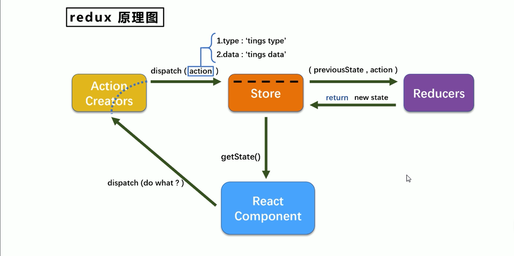

# redux 简单使用
```text
 警告
 createStore已弃用
 我们建议使用@reduxjs/toolkit包的configureStore方法，它取代了createStore。
```



## store.js

```js
// 引入createStore
import { createStore } from "redux";
// 引入reducer
import reducer from './reducer'

const store = createStore(reducer)

// 导出store
export default store
```

## reducer.js

```js
// reducer用于加工状态，接受俩个参数（preState，action）
// preState：原来的状态
// action：对象包含事情的类型、事情的数据
// 这里的事情类型为    加（increment）或者减（decrement）

// reducer调用1+n，初始化的时候，用户分发action的时候


let initState = 1000   // 初始化一个state

const reducer = (preState = initState, action) => {
  const { type, data } = action
  let newState
  switch (type) {
    case 'increment':
      return newState = preState + data
    case '减':
      return newState = preState - data
    default:
      return preState
  }
}
export default reducer
```

## 组件中使用（不建议直接在组件中引用,欲知原因，且往下看）

```jsx
import { useRef } from "react"
// 引入store  
import store from "../redux/store"
const Counter = () => {
  const selectValue = useRef()

  // 加
  const increment = () => {
    const value = selectValue.current.value * 1
    
  }

  // 减
  const decrement = () => {
    const value = selectValue.current.value * 1
    
  }

  // 如果是奇数就加
  const oddIncrement = () => {
    const value = selectValue.current.value * 1
    // if(count%2 === 0) return
    
  }

  // 两秒后加
  const asyncIncrement = () => {
    const value = selectValue.current.value * 1
    setTimeout(() => {
      
    }, 2000)
  }
  return (
    <div className="App">
          
      {<!--调用getState()方法，这里的值为1000。（reducer中设置的initState）-->}
       
      <div>count：{store.getState()}</div>
      <select ref={selectValue}>
        <option value="1">1</option>
        <option value="2">2</option>
        <option value="3">3</option>
      </select>
      <button onClick={increment}>+</button>
      <button onClick={decrement}>-</button>
      <button onClick={oddIncrement}>奇数+</button>
      <button onClick={asyncIncrement}>异步+</button>
    </div>
  )
}

export default Counter
```

## 从index.js中引用（通过props传递）

```jsx
// index.js
import React from 'react';
import ReactDOM from 'react-dom/client';
import App from './App';
import store from './redux/store';

const root = ReactDOM.createRoot(document.getElementById('root'));
root.render(
  <React.StrictMode>
    <App store={store} />
  </React.StrictMode>
);
```

```jsx
// app.js
import Counter from "./components/counter";

function App(props) {

  return <Counter store={props.store} />
  
}

export default App;
```

```jsx
// counter.js
import { useRef } from "react"
const Counter = (props) => {
  const selectValue = useRef()

  // 加
  const increment = () => {
    const value = selectValue.current.value * 1
    
  }

  // 减
  const decrement = () => {
    const value = selectValue.current.value * 1
    
  }

  // 如果是奇数就加
  const oddIncrement = () => {
    const value = selectValue.current.value * 1
    // if(count%2 === 0) return
    
  }

  // 两秒后加
  const asyncIncrement = () => {
    const value = selectValue.current.value * 1
    setTimeout(() => {
      
    }, 2000)
  }
  return (
    <div className="App">
      <div>count：{props.store.getState()}</div>
      <select ref={selectValue}>
        <option value="1">1</option>
        <option value="2">2</option>
        <option value="3">3</option>
      </select>
      <button onClick={increment}>+</button>
      <button onClick={decrement}>-</button>
      <button onClick={oddIncrement}>奇数+</button>
      <button onClick={asyncIncrement}>异步+</button>
    </div>
  )
}

export default Counter
```

## 交互(原因)

```jsx
// index.js
import React from 'react';
import ReactDOM from 'react-dom/client';
import App from './App';
import store from './redux/store';

const root = ReactDOM.createRoot(document.getElementById('root'));
root.render(
  <React.StrictMode>
    <App store={store} />
  </React.StrictMode>
);
// 不加这个，state变化，组件不重新渲染
// 检测redux中的数据变化，重新渲染组件
store.subscribe(() => {
  root.render(
    <React.StrictMode>
      <App store={store} />
    </React.StrictMode>
  );
})

```

```jsx
// counter.js
import { useRef } from "react"
const Counter = (props) => {
  const selectValue = useRef()
  const { store } = props

  // 加
  const increment = () => {
    const value = selectValue.current.value * 1
    // 分发action
    store.dispatch({
      type: 'increment',
      data: value
    })
  }

  // 减
  const decrement = () => {
    const value = selectValue.current.value * 1
    store.dispatch({
      type: '减',
      data: value
    })
  }

  // 如果是奇数就加
  const oddIncrement = () => {
    const value = selectValue.current.value * 1
    if (store.getState() % 2 === 0) return
    store.dispatch({
      type: 'increment',
      data: value
    })
  }

  // 两秒后加
  const asyncIncrement = () => {
    const value = selectValue.current.value * 1
    setTimeout(() => {
      store.dispatch({
        type: 'increment',
        data: value
      })
    }, 2000)
  }
  return (
    <div className="App">
      <div>count：{store.getState()}</div>
      <select ref={selectValue}>
        <option value="1">1</option>
        <option value="2">2</option>
        <option value="3">3</option>
      </select>
      <button onClick={increment}>+</button>
      <button onClick={decrement}>-</button>
      <button onClick={oddIncrement}>奇数+</button>
      <button onClick={asyncIncrement}>异步+</button>
    </div>
  )
}

export default Counter
```

## 之前没有action creators环节，添加上

```js
// 在redux文件中创建action_creators.js，和reducer.js、store.js同级。
// 专门创建action对象
// 创建加（increment）的action
export const incrementAction = (data) => {
  return {
    type: 'increment',
    data
  }
}
// 创建减的action
export const decrementAction = (data) => {
  return {
    type: '减',
    data
  }
}
```

## 在组件中使用

```jsx
// counter.jsx
import { useRef } from "react"
// 引入action对象
import { incrementAction, decrementAction } from "../redux/action_creators"
const Counter = (props) => {
  const selectValue = useRef()
  const { store } = props
  const count = store.getState()
  // 加
  const increment = () => {
    const value = selectValue.current.value * 1
    // 分发action
    store.dispatch(incrementAction(value))
  }

  // 减
  const decrement = () => {
    const value = selectValue.current.value * 1
    store.dispatch(decrementAction(value))
  }

  // 如果是奇数就加
  const oddIncrement = () => {
    const value = selectValue.current.value * 1
    if (count % 2 === 0) return
    store.dispatch(incrementAction(value))
  }

  // 两秒后加
  const asyncIncrement = () => {
    const value = selectValue.current.value * 1
    setTimeout(() => {
      store.dispatch(incrementAction(value))
    }, 2000)
  }
  return (
    <div className="App">
      <div>count：{count}</div>
      <select ref={selectValue}>
        <option value="1">1</option>
        <option value="2">2</option>
        <option value="3">3</option>
      </select>
      <button onClick={increment}>+</button>
      <button onClick={decrement}>-</button>
      <button onClick={oddIncrement}>奇数+</button>
      <button onClick={asyncIncrement}>异步+</button>
    </div>
  )
}

export default Counter
```

## 继续优化

```js
// 在redux文件中创建action_types.js
// 用于保存所有的action事情类型
export const INCREMENT = 'increment'
export const DCREMENT = '减'
```

### reducer.js

```js
// reducer用于加工状态，接受俩个参数（preState，action）
// preState：原来的状态
// action：对象包含事情的类型、事情的数据
// 这里的事情类型为    加（increment）或者减（decrement）

// reducer调用1+n，初始化的时候，用户分发action的时候

// 引入action对象中的类型（type）
import {INCREMENT, DCREMENT} from './action_types'

// 初始化一个state
let initState = 1000   

const reducer = (preState = initState, action) => {
  const { type, data } = action
  let newState
  switch (type) {
    case INCREMENT:
      return newState = preState + data
    case DCREMENT:
      return newState = preState - data
    default:
      return preState
  }
}
export default reducer
```

### action_creators.js

```js
// 引入action对象中的类型（type）
import {INCREMENT, DCREMENT} from './action_types'

// 创建加（increment）的action
export const incrementAction = (data) => ({type: INCREMENT,data})
// 创建减的action
export const decrementAction = (data) => ({type: DCREMENT,data})
```

# react-redux

> 一个官方维护的react插件库。
>
> 用于简化react应用中使用redux。

## react-redux 将所有的组件分为两大类

### UI组件

- 只负责UI的呈现，不带任何业务逻辑。
- 通过props接收数据(一般数据和函数)。
- 不适用任何Redux的API。
- 一般保存在components文件夹下。

### 容器组件

- 负责管理数据和业务逻辑，不负责UI呈现。
- 使用 Redux 的API。
- 一般保存在containers文件夹下。

```powershell
# 安装依赖 react-redux
yarn add react-redux
```

## 初始化状态

### index.js

```jsx
import React from 'react';
import ReactDOM from 'react-dom/client';
import App from './App';
import store from './redux/store';
import { Provider } from 'react-redux';

const root = ReactDOM.createRoot(document.getElementById('root'));
root.render(
  <React.StrictMode>
    <Provider store={store}>
      <App />
    </Provider>
  </React.StrictMode>
);
```

### app.js

```jsx
import CounterContainer from "./containers/counter_containers";

function App() {
  return <CounterContainer />
}

export default App;
```

### counter_containers.jsx（counter的容器组件）

```jsx
// counter的容器组件，起到一个连接作用
import counter from "../components/counter";
import { connect } from "react-redux";

// 从redux中把state取出来，以props的形式给UI组件
const mapStateToProps = (state) => {
  // 该方法的返回值，会作为props参数传递。相当于<Counter count={state} />
  return {
    count: state
  }
}

export default connect(mapStateToProps)(counter)
```

### counter.js（UI组件）

```jsx
import { useRef } from "react"
const Counter = (props) => {
  console.log(props);
  const selectValue = useRef()
  // 加
  const increment = () => {
    const value = selectValue.current.value * 1
  }

  // 减
  const decrement = () => {
    const value = selectValue.current.value * 1
  }

  // 如果是奇数就加
  const oddIncrement = () => {
    const value = selectValue.current.value * 1
    // if (count % 2 === 0) return
  }

  // 两秒后加
  const asyncIncrement = () => {
    const value = selectValue.current.value * 1
    setTimeout(() => {
      
    }, 2000)
  }
  return (
    <div className="App">
          
      <!--通过props拿数据-->
          
      <div>count：{props.count}</div>
      <select ref={selectValue}>
        <option value="1">1</option>
        <option value="2">2</option>
        <option value="3">3</option>
      </select>
      <button onClick={increment}>+</button>
      <button onClick={decrement}>-</button>
      <button onClick={oddIncrement}>奇数+</button>
      <button onClick={asyncIncrement}>异步+</button>
    </div>
  )
}

export default Counter
```

## 交互

### counter_containers.jsx

```jsx
// counter的容器组件，起到一个连接作用
import counter from "../components/counter";
import { connect } from "react-redux";
import {incrementAction,decrementAction} from '../redux/action_creators'

// 从redux中把state取出来，以props的形式给UI组件
const mapStateToProps = (state) => {
  // 该方法的返回值，会作为props参数传递。相当于<Counter count={state} />
  return {
    count: state
  }
}
// 从redux中把dispatch取出来，以props的形式给UI组件
const mapMethodToProps = (dispatch) => {

  return {
    // 该方法的返回值，会作为props参数传递。相当于<Counter increment={操作方法dispatch} />
    increment: (data) => {
      return dispatch(incrementAction(data))
    },
    // 该方法的返回值，会作为props参数传递。相当于<Counter decrement={操作方法dispatch} />
    decrement: (data) => {
      return dispatch(decrementAction(data))
    }
  }
}

export default connect(mapStateToProps,mapMethodToProps)(counter)
```

### counter.js

```jsx
import { useRef } from "react"
const Counter = (props) => {
  const selectValue = useRef()
  // 解构赋值，因为有方法名为increment和decrement，我们起个别名incrementAction和decrementAction
  const {count,increment: incrementAction,decrement: decrementAction} = props
  // 加
  const increment = () => {
    const value = selectValue.current.value * 1
    incrementAction(value)
  }

  // 减
  const decrement = () => {
    const value = selectValue.current.value * 1
    decrementAction(value)
  }

  // 如果是奇数就加
  const oddIncrement = () => {
    const value = selectValue.current.value * 1
    if (count % 2 === 0) return
    incrementAction(value)
  }

  // 两秒后加
  const asyncIncrement = () => {
    const value = selectValue.current.value * 1
    setTimeout(() => {
      incrementAction(value)
    }, 2000)
  }
  return (
    <div className="App">
      <div>count：{count}</div>
      <select ref={selectValue}>
        <option value="1">1</option>
        <option value="2">2</option>
        <option value="3">3</option>
      </select>
      <button onClick={increment}>+</button>
      <button onClick={decrement}>-</button>
      <button onClick={oddIncrement}>奇数+</button>
      <button onClick={asyncIncrement}>异步+</button>
    </div>
  )
}

export default Counter
```

