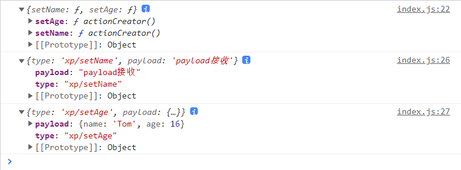

# redux


 ## **Redux Toolkit**

```powershell
npm install react-redux @reduxjs/toolkit

yarn add react-redux @reduxjs/toolkit
```

## 使用

### store/slices/stuSlice.js

```js
// store/slices/stuSlice
import { createSlice } from '@reduxjs/toolkit'

const stuSlice = createSlice({
  initialState: {
    name: '焰灵姬',
    age: 18,
    sex: 'nv'
  },            // 初始化数据
  name: 'xp',  // 用来自动生成action中的type
  reducers: {   // 指定state的各种操作
    setName(state,action){
      // 可以通过不同的方法，来指定对state的不同操作
      // state是一个代理对象，并不是直接把原来的state返回了，可以直接修改
      state.name = "赤炼"  // 不需要复制后再去修改
    },
    setAge(state,action) {
      state.age = 19
    }
  }
})

console.log(stuSlice.actions);

// actions中存储的是slice自动生成的action创建器(函数)， 调用后会自动创建action对象
// action对象结构是 {type：name/函数名，payload：函数的参数}
export const { setName, setAge} = stuSlice.actions

console.log(setName('payload接收'));
console.log(setAge({name: 'Tom',age: 16}));
```



### store/slices/counterSlice.js

```js
// store/slices/counterSlice.js
import { createSlice } from '@reduxjs/toolkit'
const counterSlice = createSlice({
  name: 'count',
  initialState: {
    value: 0,
    title: "redux toolkit pre"
  },
  reducers: {
    increment(state,action) {
      state.value ++
    },
    decrement(state,action) {
      state.value -= 1
    }
  }
})
// 导出加减的方法
export const { increment, decrement } = counterSlice.actions;

// 默认导出
export default counterSlice;
```

### store/index.js

```js
import { configureStore } from '@reduxjs/toolkit'
import stuSlice from './slices/stuSlice'
import counterSlice from './slices/counterSlice'

// 创建store 
const store = configureStore({
  reducer: {
    student: stuSlice.reducer,
    count: counterSlice.reducer
  }
})

export default store
```

### index.js

```JSX
import React from 'react';
import ReactDOM from 'react-dom/client';
import App from './App';
import { Provider } from 'react-redux';
import store from './store/index'

const root = ReactDOM.createRoot(document.getElementById('root'));
root.render(
  <React.StrictMode>
    <Provider store={store}>
      <App />
    </Provider>
  </React.StrictMode>
);

```

### components/toolkit.jsx

```jsx
import {useSelector,useDispatch} from 'react-redux'
import {increment, decrement} from '../store/slices/counterSlice.js'
const Toolkit = () => {
  // useSelector()用来加载state中的数据
  const {value} = useSelector(state => state.count)
  // 用来分发state操作命令
  const dispatch = useDispatch()
  const incrementClick = () => {
    dispatch(increment())
  }
  const decrementClick = () => {
    dispatch(decrement())
  }
  return (
    <div>
      <button onClick={incrementClick}>增加</button>
      <span style={{margin: '0 10px'}}>{value}</span>
      <button onClick={decrementClick}>减少</button>
    </div>
  )
}

export default Toolkit
```

